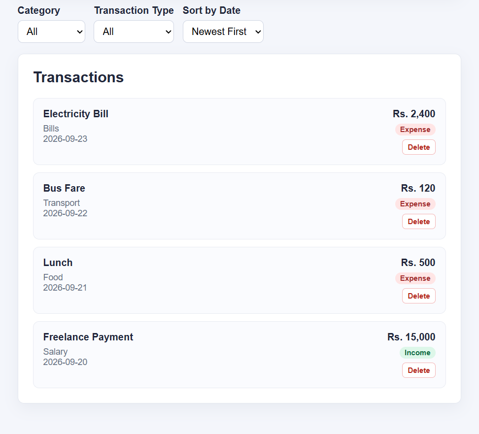
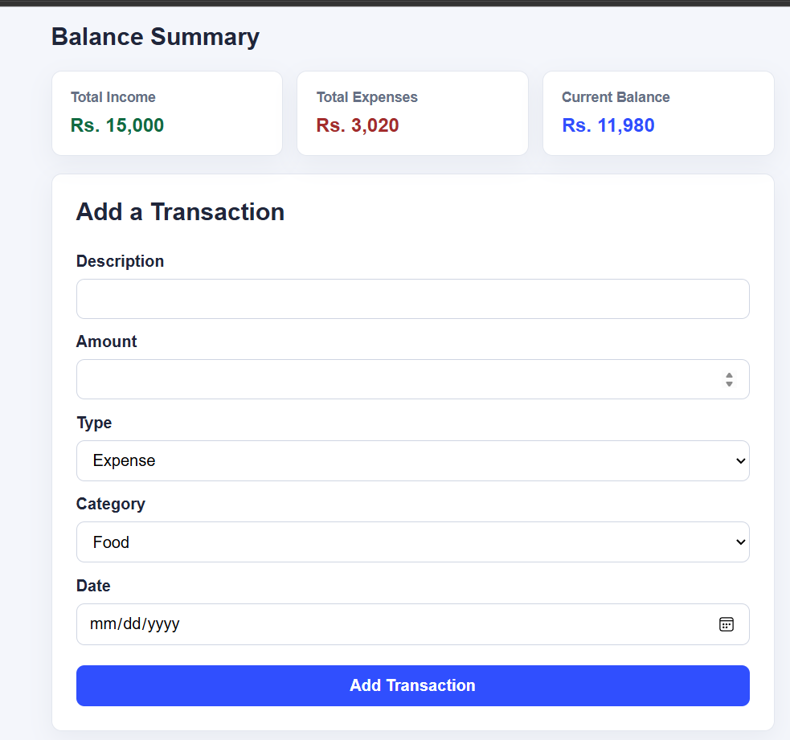
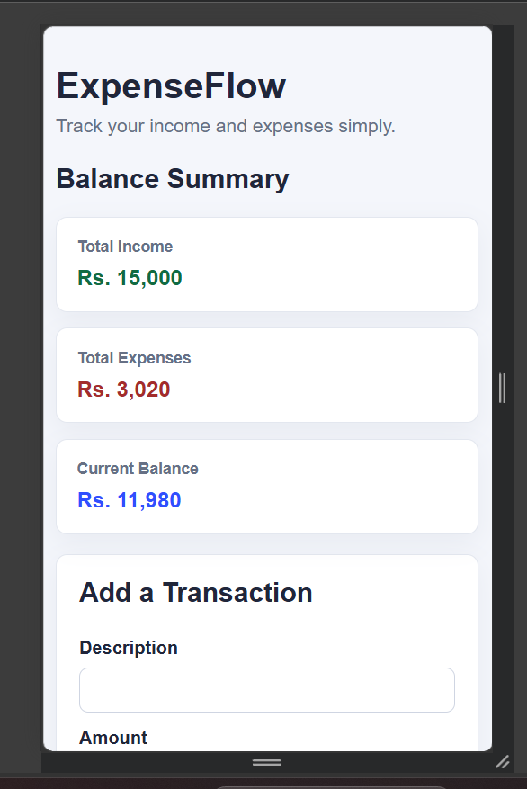

# ExpenseFlow

## Description

ExpenseFlow is a simple React personal expense tracker. Users can add income and expenses, monitor their balance, filter and sort transactions, and keep transaction data stored in the browser.

## Features

- Add income transactions
- Add expense transactions
- View transaction history
- Delete transactions
- Total income
- Total expenses
- Current balance
- Filter by category
- Filter by type
- Sort by date
- localStorage persistence
- Responsive layout

## Technologies Used

- React
- Create React App
- JavaScript
- CSS
- Browser localStorage

## React Concepts Used

- Functional components
- Props
- Callback props
- useState
- useEffect
- Controlled forms
- Event handling
- List rendering
- Conditional rendering

## Installation

In the project folder, run:

```bash
npm install
npm start
```

The app normally opens at `http://localhost:3000`.

## Screenshots

### Expense Dashboard



### Add Transaction Form



### Mobile View



## Known Limitations

- No backend database
- No login system
- Data is stored only in the current browser
- Data does not sync between devices
